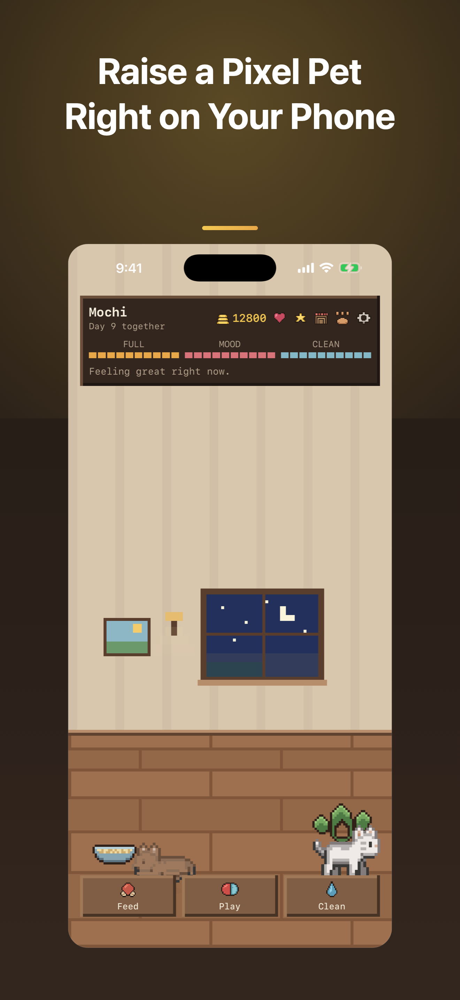
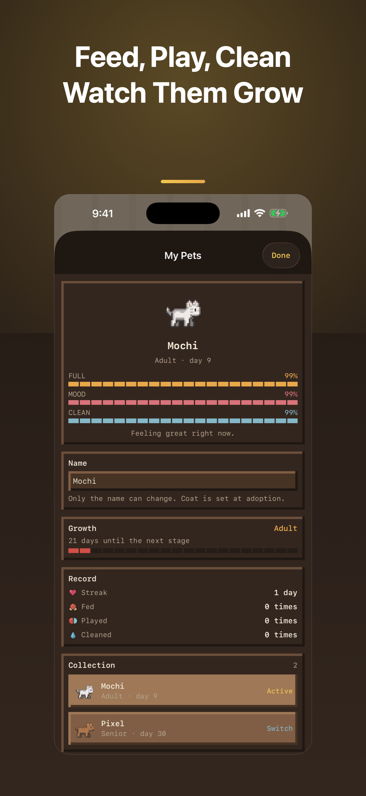
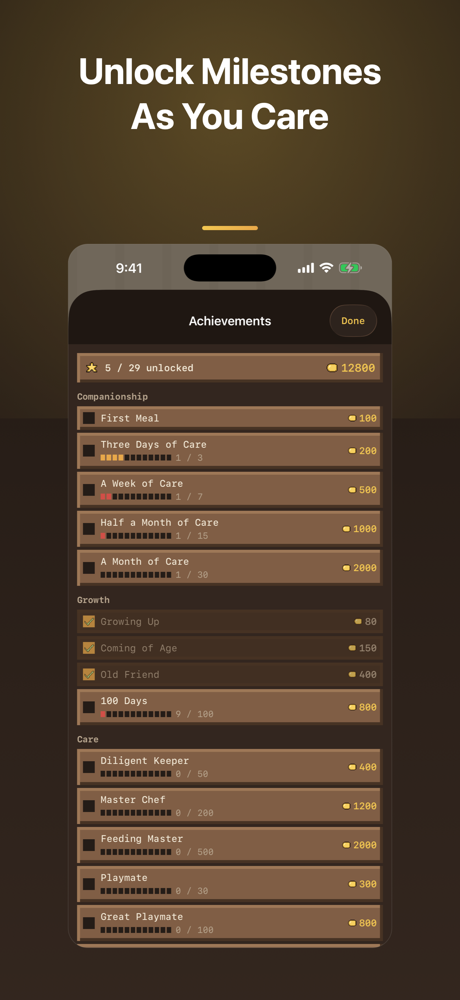

# PixelPet

A pixel pet that lives on your phone. Feed it, play with it, wash it, and watch it grow through four life stages. Fully offline — no account, no network, no ads.

<p align="center">
  
  
  
</p>

SwiftUI + SpriteKit, iOS 17+, 20 languages, ~9.6k lines of Swift across 48 files, 240 tests.

## How it works

The pet's meters move with **real time**, so you don't keep the app open. When you come back, coins are settled from how well-fed and happy it was while you were away.

There's no background timer here, and that's deliberate: iOS doesn't grant third-party apps one. So state is always computed from `now - lastFedAt` rather than stored as a snapshot. A stored "current hunger" would freeze the moment the app backgrounds, and you'd return to numbers that quietly lie to you. The same decision is what makes offline earnings fall out naturally — settling earnings and computing state are the same calculation.

**Caring well is the whole loop.** Earnings are `daily cap × fulfilment rate`, where the rate comes from your pet's average satiety and mood while you were gone. Neglect penalizes itself; no separate punishment rule is needed. Mood is weighted heavier than satiety (0.60 / 0.40) — mood is the emotional core of a pet app, and it shouldn't be satisfiable by dumping food in a bowl.

Because each pet has a **per-day cap**, checking in obsessively doesn't out-earn caring properly. That's the point.

| | |
|---|---|
| Life stages | Baby → Young (day 3) → Adult (day 7) → Senior (day 30) |
| Daily cap | 170 / 195 / 225 / 205 coins by stage |
| Hunger cycle | 12 / 10 / 8 / 9 hours by stage — small pets eat less |
| Food | 4 tiers: free scraps → kibble → can (+mood) → dried fish (+mood, +boost) |
| Achievements | 29 across 6 groups |
| Breeds | Cat (balanced) and dog (clingy: mood drains faster, earns 1.10×), 4 coats each |

Stage frames aren't scaled copies. `tools/make_stages.py` derives them from the adult sheet by dropping torso rows, which changes the head-to-body ratio — plain scaling shrinks the head too and just reads as "the same pet, further away."

Free scraps exist to break a specific deadlock: no coins → pet stays hungry → low fulfilment → still no coins. A weak free option keeps that loop from closing on players who stay away a while.

## Privacy

Every claim below is a code fact, not boilerplate — and each is pinned by a test in `PrivacyClaimTests`, so if someone later adds a network call the test fails rather than the About page turning into a lie.

- **Zero network.** No `URLSession`, `URLRequest`, or `NWConnection` anywhere in `Sources/`.
- **Local only.** Pets, coins, and room layout live in `Application Support/{pet,wallet,room}.json` plus `UserDefaults`. Deleting the app deletes everything; there is no copy elsewhere.
- **No account, no analytics, no ads, no tracking.** `PrivacyInfo.xcprivacy` declares no collected data types.
- **One permission, off by default.** Notifications, used only for pet-status reminders, quiet overnight.

## Build

```bash
brew install xcodegen        # project.yml is the source of truth; .xcodeproj is generated
xcodegen generate
open PixelPet.xcodeproj
```

```bash
# tests: 235 unit + 5 UI
xcodebuild -project PixelPet.xcodeproj -scheme PixelPet \
  -destination 'platform=iOS Simulator,name=iPhone 17 Pro Max' test
```

That's everything you need for the simulator — no signing setup required. To run on a real device, point the build at your own Apple team:

```bash
cp Config/Local.xcconfig.example Config/Local.xcconfig   # then fill in your team ID
```

`Config/Local.xcconfig` is gitignored, and `Shared.xcconfig` pulls it in via `#include?`, which no-ops when the file is absent. No team ID is committed, so a clone never tries to sign with someone else's account.

## Architecture

```
Core → Models → {Scenes, Services} → Views → App
```

Dependencies flow strictly one way. `Models` imports nothing above it, which is why most of the 235 unit tests live there and need no UI.

This is **enforced by `tools/check_layers.sh` in a pre-build phase — a violation fails the build**, rather than relying on discipline. It exists because three real violations already happened (`Models/Interaction` reaching into `Views/PixelIcon`, and two more; see `docs/06-architecture.md`). Splitting into SPM modules would let the compiler enforce it natively, but at this size it costs ~350 `public` annotations and 6 `Package.swift` files for the same guarantee.

Full design docs — economy math, balance tuning log, food tiers, shop — are in [`docs/`](docs/).

## Localization

20 languages, 251 keys each, at 100% coverage. English is both the source and the fallback.

Three lists must stay identical, and if any one drifts the translations are silently dropped from the bundle:

1. the languages in `Resources/*.xcstrings`
2. `knownRegions` in `project.yml`
3. `AppLanguage.all` in the language picker

Plurals follow each language's real CLDR categories: one `other` for CJK/th/id/vi, four for ru/pl, six for ar.

Runtime language switching goes through `L()`, not `String(localized:)`. Foundation locks which `.lproj` it reads **at process start**, so writing `AppleLanguages` only affects the *next* launch — the usual cause of "I switched languages but half the text didn't change." `LocalizationManager` instead redirects `Bundle.main`'s string lookup to the chosen bundle, so switching takes effect immediately.

Hand-writing 251 × 18 translations makes silent mistakes inevitable — Korean text leaked into the Japanese file, and a Russian string lost a letter. So `tools/check_translation.py` mechanically checks key sets, placeholders (count, type, and positional index, per plural category), CLDR categories, and script mixing:

```bash
python3 tools/check_translation.py <en.json> <lang.json>
```

It can't catch everything. Two dropped Thai characters and an untranslated Indonesian cat purr were found only by rereading. Semantics still need human eyes, and the RTL mirroring in Arabic is still worth checking on a real device.

## Assets

Every asset's license is documented verbatim, with source URLs and SHA-256 hashes, in [`ASSET-PROVENANCE/`](ASSET-PROVENANCE/).

| Asset | Source | License |
|---|---|---|
| Pet sprites | [LPC Cats and Dogs](https://opengameart.org/content/lpc-cats-and-dogs) by bluecarrot16 | CC-BY 3.0 |
| Room objects | [Home Objects](https://opengameart.org/content/home-objects) by Jannax | CC0 |
| Emotes | [16x16 Emotes](https://opengameart.org/content/16x16-emotes-for-rpgs-and-digital-pets) by Tomcat94 | CC0 |
| UI icons | original to this project (`tools/make_ui_icons.py`) | — |

The UI icons are hand-drawn rather than SF Symbols or emoji, for two reasons: emoji are high-resolution gradient art that flattens the pixel feel of a 4×-scaled sprite sitting next to them, and their glyphs change between iOS versions. A test bans `systemName:`/`systemImage:` outright — a missing symbol renders as a tofu box, which is the most glaring possible break in a pixel-art app.
